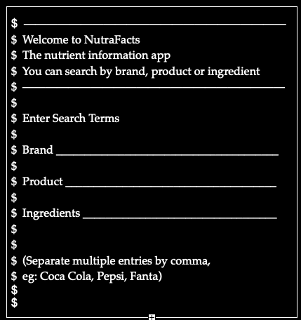
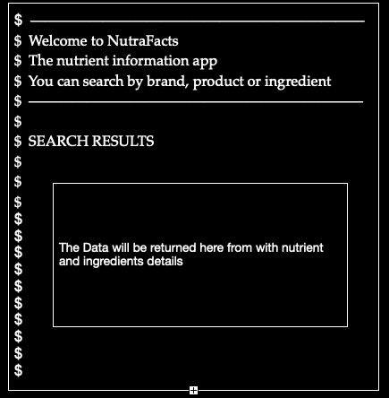

# NutraFacts!

The NutraFacts app is a proof of concept tool that helps people underatnt the nutriuant values of day to day infrediants and products

## Program Concept
The program links open food facts db and alloes earch terms to be passed to search for.

- 1: enter e earch term, either a product or individual ingrediant eg. a products llke Pepsi or amd like tomatoes, etc etc

- 2: Returns Ingrediant and nutrients for the produtc/ingrediant search for

## Features!" 

- A search Screen alound inpot of Brand, Produt or ingredients
- click submit search
- a list of nutrients and ingrediants will be returend.

